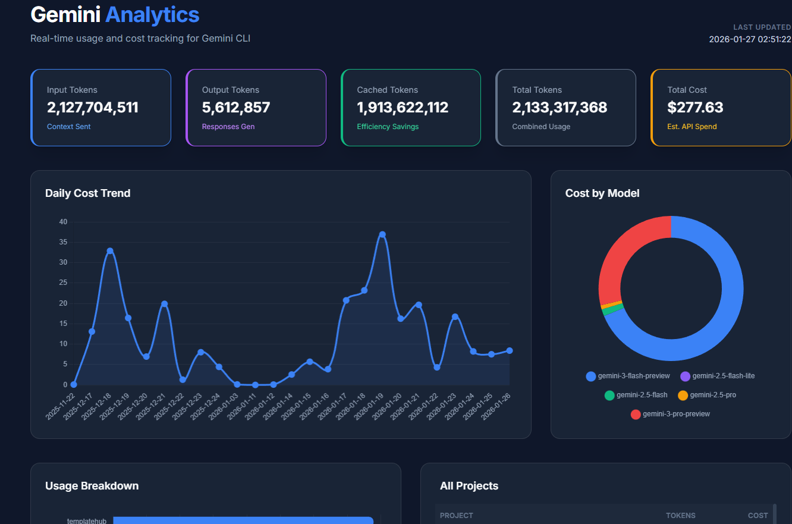

# 🚀 AI CLI Usage Analytics

A high-performance visual dashboard for tracking your AI CLI tools usage, token consumption, and estimated API costs. Now supports **Gemini CLI**, **Codex CLI (OpenAI)**, and **Opencode CLI**!



## ✨ Features

- **Multi-CLI Support**: Track usage across Gemini CLI, Codex CLI (OpenAI), and Opencode CLI in one dashboard.
- **Project-Specific Tracking**: Automatically resolves cryptic project hashes to actual folder names using your `trustedFolders.json`.
- **Token Breakdown**: Detailed analysis of Input, Output, and Cached tokens for all supported CLIs.
- **Cost Estimation**: Estimates API spend based on real-time pricing models:
  - **Gemini**: 3.0 Pro/Flash, 2.5 Pro/Flash/Lite
  - **Codex CLI (OpenAI)**: GPT-5.2 (Instant/Thinking/Pro/Codex), GPT-5.1, GPT-5-nano, o3-mini, o1, GPT-4o
  - **Anthropic**: Claude Opus 4.6/4.5, Sonnet 4.5/4, Haiku 4.5, Claude 3.7/3.5
  - **Opencode Zen Exclusive**: Kimi K2.5, GLM 4.7, MiniMax M2.5
- **Interactive Visuals**: Beautiful charts for daily spending trends, cost by model, and usage breakdown by project.
- **Zero Configuration**: Just run it, and it finds your CLI logs automatically.

## 🚀 Quick Start

No installation required! Just run this command in your terminal:

```bash
npx github:ayman-beep/gemini-usage-stats
```

The dashboard will be generated and **automatically open in your default browser**.

You'll see a unified view showing:
- Combined statistics across all CLI tools
- Individual breakdowns for each CLI (Gemini, Codex, Opencode)
- Daily cost trends and model usage comparisons
- Project-specific tracking with cost allocation

## 🛠 Prerequisites

- **Python 3.x** must be installed and available in your system path.
- **Node.js** (for npx support).
- **CLI Tools**: Install one or more of the supported CLI tools (Gemini, Codex, or Opencode) to start tracking usage.

## 🛠 Supported CLI Tools

### Gemini CLI (Google)
The original CLI tool for Google's Gemini AI models.
- **Installation**: `npm install -g @google/gemini-cli`
- **Data Location**: `~/.gemini/tmp/`
- **Models**: Gemini 3.0 Pro/Flash, Gemini 2.5 Pro/Flash/Lite

### Codex CLI (OpenAI)
A lightweight coding agent that runs locally in your terminal.
- **Installation**: `npm install -g @openai/codex`
- **Data Location**: `~/.codex/sessions/`
- **Models**: GPT-5-Codex, GPT-4-Codex, o3-mini, o1, GPT-4o
- **GitHub**: https://github.com/openai/codex

### Opencode CLI (Anomaly)
An open-source AI coding agent with multi-provider support.
- **Installation**: `curl -fsSL https://opencode.ai/install | bash`
- **Data Location**: `~/.local/share/opencode/`
- **Models**: Claude 3.7/3.5 Sonnet, Claude 3 Opus, GPT-4o, Gemini
- **GitHub**: https://github.com/anomalyco/opencode

## 📂 How it Works

The tool works by:
1. Scanning your local CLI cache directories:
   - `~/.gemini/tmp/` for Gemini CLI
   - `~/.codex/sessions/` for Codex CLI
   - `~/.local/share/opencode/` for Opencode CLI
2. Mapping project hashes to directory paths found in configuration files.
3. Aggregating usage statistics from session JSON/JSONL files.
4. Calculating costs based on up-to-date pricing models.
5. Generating a responsive, Tailwind-powered HTML dashboard with charts for all CLI tools.

## 📄 License

MIT © ayman-beep
